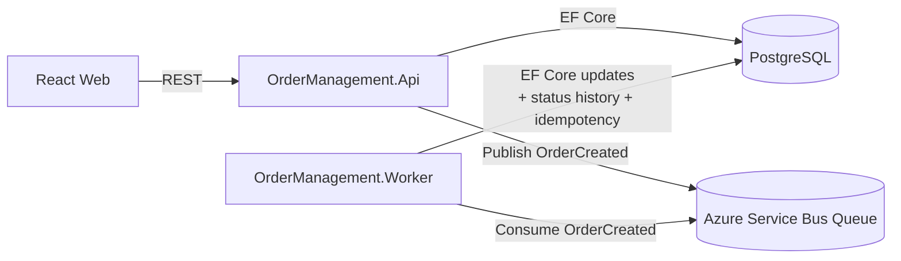

# Order Management (Technical Test)

MVP of an order management system with:

- API: .NET 8 Web API + EF Core
- DB: PostgreSQL
- Messaging: Azure Service Bus (real integration via env vars)
- Worker: consumes `OrderCreated` events and updates status asynchronously
- Frontend: React + Vite + Tailwind (polling UI)
- Infra: Docker + Docker Compose (api, worker, frontend, postgres, pgadmin)

## Architecture (Mermaid)



## Status workflow

1) `POST /orders` creates an `Order` with status `Pending` and writes a first row into `OrderStatusHistory`
2) API publishes a Service Bus message:
   - `CorrelationId = OrderId`
   - `ApplicationProperties["EventType"] = "OrderCreated"`
3) Worker consumes the message (idempotent by `MessageId` persisted in `ProcessedMessage`)
4) Worker updates status:
   - `Pending -> Processing`
   - waits 5 seconds
   - `Processing -> Completed`
   - every transition writes a row into `OrderStatusHistory`

## Local run (Docker Compose)

Prereqs:
- Docker Desktop
- An Azure Service Bus namespace + a connection string (see below)

1) Create `.env` from `.env.example` and fill:
- `AZURE_SERVICE_BUS_CONNECTION_STRING`
- optionally `AZURE_SERVICE_BUS_QUEUE_NAME` (default `orders`)

2) Start everything:

```bash
docker compose --env-file .env up --build
```

Services:
- API: `http://localhost:8080` (Swagger in Development)
- Health: `http://localhost:8080/health`
- Frontend: `http://localhost:5173`
- PgAdmin: `http://localhost:5050`

Notes:
- The API applies EF Core migrations automatically on startup.
- The API attempts to create the queue if the Service Bus credentials include management rights.

## Azure Service Bus setup

You need a queue and a connection string:
- Recommended: use a SAS policy with `Send` for the API and `Listen` for the worker.
- If you don't have management rights, create the queue manually in the Azure Portal.

Environment variables used:
- `AZURE_SERVICE_BUS_CONNECTION_STRING` (required for end-to-end async status flow)
- `AZURE_SERVICE_BUS_QUEUE_NAME` (default: `orders`)

## API endpoints

### Create order

`POST /orders`

Request:

```json
{
  "customer": "Acme Inc.",
  "product": "Widget",
  "value": 99.90
}
```

Response (201):

```json
{
  "id": "b3b6c61e-7bb8-4c88-99e7-0b0bf2c5e3e1",
  "customer": "Acme Inc.",
  "product": "Widget",
  "value": 99.90,
  "status": "Pending",
  "createdAt": "2026-04-21T01:23:45.678Z",
  "updatedAt": null,
  "statusHistory": [
    {
      "id": "f5a8d0c0-1b4b-4b98-9d1e-4ac2b5a48ed1",
      "previousStatus": null,
      "newStatus": "Pending",
      "changedAt": "2026-04-21T01:23:45.678Z",
      "source": "api"
    }
  ]
}
```

### List orders

`GET /orders`

### Get order by id

`GET /orders/{id}`

## Project structure

- `src/OrderManagement.Domain`: entities + enums
- `src/OrderManagement.Application`: DTOs + use cases (order service) + message contracts
- `src/OrderManagement.Infrastructure`: EF Core + Service Bus publisher + DI
- `src/OrderManagement.Api`: controllers + middleware + health checks
- `src/OrderManagement.Worker`: Service Bus consumer + idempotency + status transitions
- `web/order-management-web`: React UI (Tailwind + polling)

