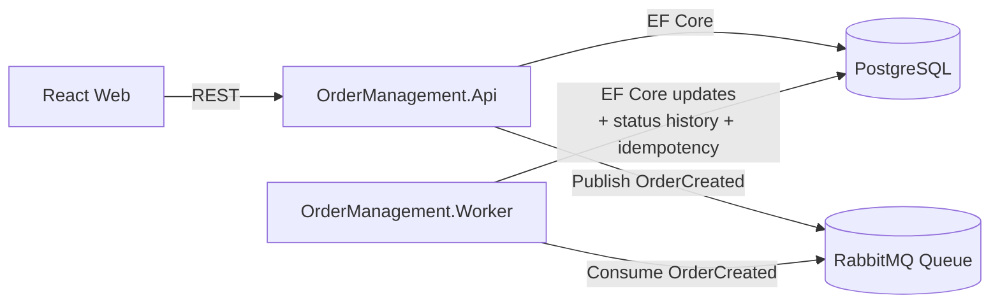

# Gestão de Pedidos (Teste Técnico)

MVP de um sistema de gestão de pedidos com:

- API: .NET 8 Web API + EF Core
- DB: PostgreSQL
- Mensageria: RabbitMQ (fila “clássica”)
- Worker: consome eventos `OrderCreated` e atualiza o status de forma assíncrona
- Frontend: React + Vite + Tailwind (UI com polling)
- Infra: Docker + Docker Compose (api, worker, frontend, postgres, pgadmin, rabbitmq)

## Por que RabbitMQ?

Troquei o transporte de mensageria para RabbitMQ por **maior familiaridade/conhecimento prático** com a ferramenta, o que ajuda a entregar uma implementação mais rápida, consistente e fácil de manter para este MVP/teste técnico.

## Arquitetura (Mermaid)



## Fluxo de status

1) `POST /orders` cria um `Order` com status `Pending` e grava a primeira linha em `OrderStatusHistory`
2) A API publica uma mensagem na fila RabbitMQ:
   - `CorrelationId = OrderId`
   - `Type = "OrderCreated"`
   - `MessageId` gerado para idempotência
3) O worker consome a mensagem (idempotente por `MessageId` persistido em `ProcessedMessage`)
4) O worker atualiza o status:
   - `Pending -> Processing`
   - aguarda 5 segundos
   - `Processing -> Completed`
   - cada transição grava uma linha em `OrderStatusHistory`

## Execução local (Docker Compose)

Pré-requisitos:
- Docker Desktop

1) Crie o `.env` a partir do `.env.example` e ajuste se quiser.

2) Suba tudo:

```bash
docker compose --env-file .env up --build
```

Serviços:
- API: `http://localhost:8080` (Swagger em Development)
- Health: `http://localhost:8080/health`
- Frontend: `http://localhost:5173`
- PgAdmin: `http://localhost:5050`
- RabbitMQ Management: `http://localhost:15672` (user/pass padrão: `guest`/`guest`)

Observações:
- A API aplica as migrations do EF Core automaticamente na inicialização.
- A fila `orders` é declarada automaticamente pela API/worker (caso não exista).

## Endpoints da API

### Criar pedido

`POST /orders`

Request (exemplo):

```json
{
  "customer": "Acme Ltda.",
  "product": "Produto X",
  "value": 99.90
}
```

Response (201) (exemplo):

```json
{
  "id": "b3b6c61e-7bb8-4c88-99e7-0b0bf2c5e3e1",
  "customer": "Acme Ltda.",
  "product": "Produto X",
  "value": 99.90,
  "status": "Pending",
  "createdAt": "2026-04-21T01:23:45.678Z",
  "updatedAt": null,
  "statusHistory": [
    {
      "id": "f5a8d0c0-1b4b-4b98-9d1e-4ac2b5a48ed1",
      "previousStatus": null,
      "newStatus": "Pending",
      "changedAt": "2026-04-21T01:23:45.678Z",
      "source": "api"
    }
  ]
}
```

### Listar pedidos

`GET /orders`

### Buscar pedido por id

`GET /orders/{id}`

## Estrutura do projeto

- `src/OrderManagement.Domain`: entities + enums
- `src/OrderManagement.Application`: DTOs + casos de uso (order service) + contratos de mensagem
- `src/OrderManagement.Infrastructure`: EF Core + RabbitMQ publisher + DI
- `src/OrderManagement.Api`: controllers + middleware + health checks
- `src/OrderManagement.Worker`: consumer RabbitMQ + idempotência + transições de status
- `web/order-management-web`: UI em React (Tailwind + polling)

